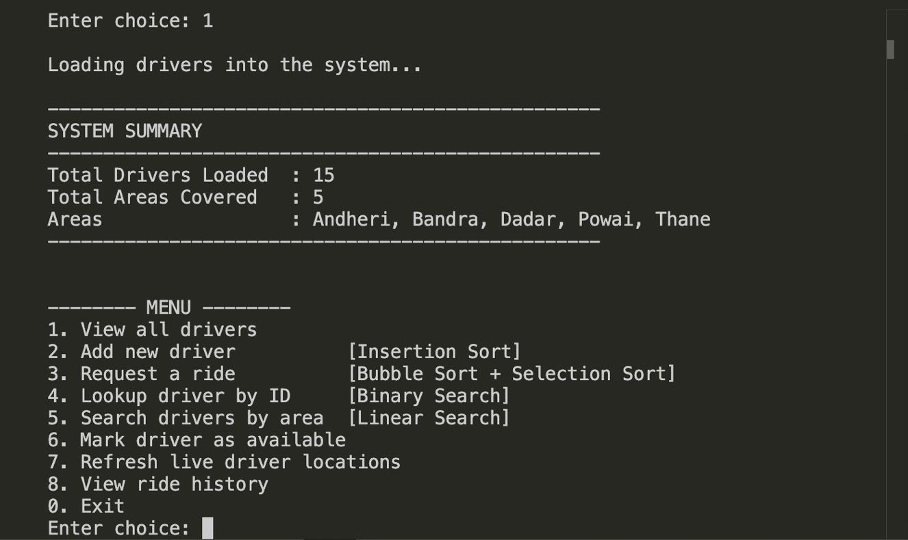
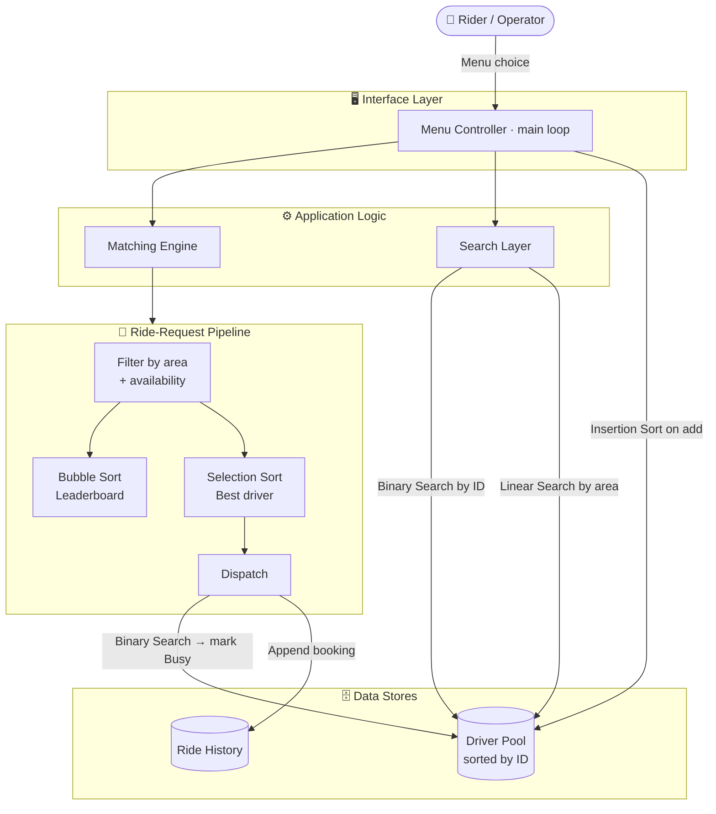
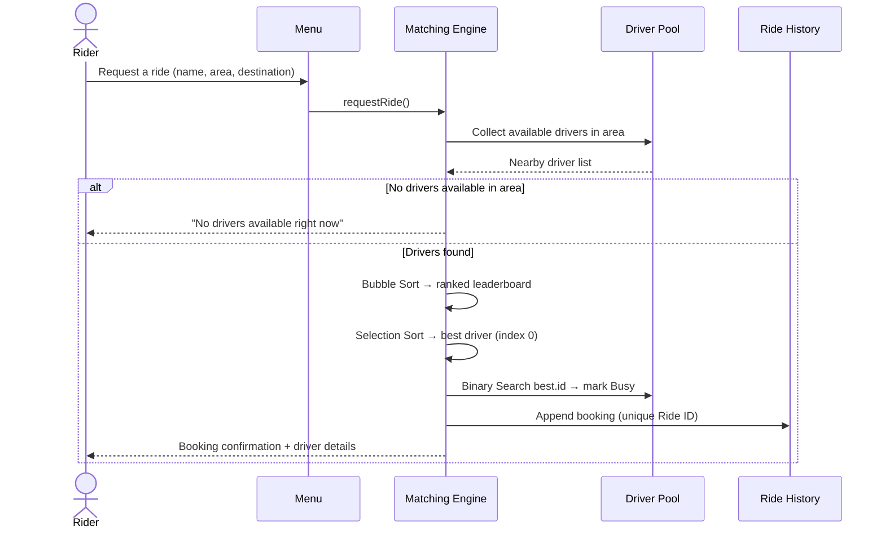

<div align="center">


# 🚖 Smart Ride Allocation System

### A console-based ride-matching engine that ranks, selects, and dispatches the best driver using five classic Data Structures & Algorithms — implemented in pure C++.

[](https://isocpp.org/)
[-A42E2B?style=flat&logo=gnu&logoColor=white)](https://gcc.gnu.org/)
[](#)
[](#-algorithms-at-a-glance)
[](#-license)

<br/>


</div>

---

## 📑 Table of Contents

- [Overview](#-overview)
- [Key Features](#-key-features)
- [Algorithms at a Glance](#-algorithms-at-a-glance)
- [The Suitability Score](#-the-suitability-score)
- [Screenshots](#-screenshots)
- [Tech Stack](#-tech-stack)
- [System Architecture](#-system-architecture)
- [Project Workflow](#-project-workflow)
- [Installation](#-installation)
- [Project Structure](#-project-structure)
- [Usage](#-usage)
- [Features Demonstration](#-features-demonstration)
- [Challenges Solved](#-challenges-solved)
- [Future Enhancements](#-future-enhancements)
- [License](#-license)
- [Author](#-author)

---

## 🧭 Overview

**Smart Ride Allocation System** is a menu-driven C++ application that simulates the core matching engine of a ride-hailing platform such as Uber or Ola — minus the network, minus the database, minus the framework noise.

Given a live pool of drivers — each with a different **distance**, **rating**, and **surge multiplier** — the system answers one deceptively hard question:

> *"For a rider standing in a given area right now, which single driver is the best match, and how do we find, rank, and dispatch them efficiently while keeping the entire driver database sorted and searchable at all times?"*

The project answers this using **five fundamental algorithms**, each chosen for a specific, justified role rather than for novelty. Every driver is scored, every available driver in the rider's area is ranked into a transparent leaderboard, and the best driver is independently selected and dispatched — then marked busy and written to a ride-history log.

It is built **entirely from first principles** — `struct`, raw arrays, functions, and loops — with **zero external libraries**, making it a clean, self-contained demonstration of how textbook DSA powers a believable real-world product.

> 🎓 Developed as a Data Structures & Algorithms case study at **ITM Skills University** (B.Tech CSE, 2025–29, Semester II).

---

## ✨ Key Features

- 🔢 **Always-sorted driver pool** — every new driver is slotted into place by ID using **Insertion Sort**, so the database never needs a full re-sort.
- 🏆 **Ranked driver leaderboard** — **Bubble Sort** (stable) ranks all eligible drivers by suitability score so equal-scoring drivers keep their original order for fairness.
- 🎯 **Independent best-driver dispatch** — **Selection Sort** works on a separate copy to pick and dispatch the single best driver with minimal swaps.
- ⚡ **Instant lookup by ID** — **Binary Search** finds any driver (or marks them busy) in `O(log n)` because the pool is always sorted.
- 📍 **Area-based discovery** — **Linear Search** lists every available driver in a given area, with multi-condition (area **AND** availability) filtering.
- 🧮 **Weighted suitability scoring** — combines distance, rating, and surge into a single comparable score.
- 🔄 **Live location simulation** — randomly refreshes driver distances to mimic moving vehicles, dynamically changing who gets dispatched next.
- 🗂️ **Ride history log** — every booking is recorded with a unique Ride ID and viewable on demand.
- 🛡️ **Robust input validation** — duplicate-ID prevention, rating range checks (1.0–5.0), surge floor (≥ 1.0), and array-bounds safety.
- 🔡 **Case-insensitive search** — `andheri`, `Andheri`, and `ANDHERI` are all treated identically.
- 📦 **Zero dependencies** — single `.cpp` file, standard library only, compiles anywhere `g++` runs.

---

## 🧠 Algorithms at a Glance

Each algorithm earns its place — it is used where it is genuinely the right tool, not just to tick a box.

| # | Algorithm | Where It's Used | Why This One | Time (Avg/Worst) | Space |
|---|-----------|-----------------|--------------|:----------------:|:-----:|
| 1 | **Insertion Sort** | Adding a driver to the pool | Pool is almost-sorted, so insertion is `O(n)` in practice | `O(n²)` | `O(1)` |
| 2 | **Bubble Sort** | Building the ranked leaderboard | Stable → equal scores keep their order (fairness) | `O(n²)` | `O(1)` |
| 3 | **Selection Sort** | Selecting the single best driver | Minimal swaps (≤ n−1); independent of the leaderboard | `O(n²)` | `O(1)` |
| 4 | **Binary Search** | Lookup / mark-busy by Driver ID | Pool is sorted by ID → `O(log n)` retrieval | `O(log n)` | `O(1)` |
| 5 | **Linear Search** | Find drivers by area + availability | Pool isn't sorted by area; needs full multi-condition scan | `O(n)` | `O(1)` |

> 💡 For a 15-driver pool, **Binary Search** finds any driver in at most **4 comparisons**, versus up to **15** for a linear scan.

---

## 🧮 The Suitability Score

Drivers are compared using a single weighted score. **Lower is better.**

```
Score = Distance(km) + (5.0 − Rating) + Surge Factor
```

| Component | Effect | Intuition |
|-----------|--------|-----------|
| **Distance** | Added directly | Closer driver → lower score → preferred |
| **(5.0 − Rating)** | Inverts rating | A 4.8★ driver adds only 0.2; a 3.5★ driver adds 1.5 |
| **Surge Factor** | Added directly | No surge (1.0) adds 1; high surge (2.0) adds 2 |

**Worked example:**

```
Driver A → Distance 1.2, Rating 4.2, Surge 1.5 → 1.2 + 0.8 + 1.5 = 3.5  ✅ dispatched
Driver B → Distance 2.5, Rating 4.8, Surge 1.0 → 2.5 + 0.2 + 1.0 = 3.7
```

Driver A wins despite Driver B's higher rating, because distance and surge tip the balance — exactly the kind of multi-factor trade-off a real dispatcher makes.

---

## 📸 Screenshots

### 1. Program Welcome Screen
The application launches with a branded splash and a minimal Start / Exit gate. The screenshot also shows the exact single-line `g++` compile-and-run command used to build it.


### 2. Main Menu & System Summary
After selecting **Start**, 15 sample drivers are silently loaded across 5 Mumbai areas. The system prints a summary, then the operations menu — each entry annotated with the algorithm it triggers.



### 3. View All Drivers (Sorted by ID)
The full pool, displayed in ascending ID order — proof that **Insertion Sort** kept the database sorted even though the sample data was loaded with deliberately shuffled IDs. Each row shows the live computed **Score** and **Status**.


### 4. Request a Ride (Bubble Sort + Selection Sort)
A rider requests a ride. The engine builds a ranked leaderboard, independently selects the best driver, locates them via **Binary Search**, marks them **Busy**, and prints a full booking confirmation.


### 5. Binary Search — Driver Lookup by ID
Looking up Driver `101` returns the record in `O(log n)`. Note the status now reads **Busy** — confirming the booking from the previous step propagated back to the main pool.


### 6. Ride History
Every completed booking is persisted to a history log with a unique Ride ID, rider, driver, pickup, and destination — viewable at any time.


---

## 🛠️ Tech Stack

<div align="center">

| Layer | Technology |
|-------|-----------|
| **Language** | C++ (C++11 compatible) |
| **Paradigm** | Procedural + lightweight `struct`-based data modelling |
| **Core Library** | C++ Standard Library only — `<iostream>`, `<string>`, `<cstdlib>` |
| **Data Structures** | Fixed-size arrays of `struct` (driver pool & ride history) |
| **Algorithms** | Insertion, Bubble, Selection Sort · Binary & Linear Search |
| **Interface** | Interactive text-based console / CLI menu |
| **Build Tool** | `g++` (GCC) — also compiles under Clang / MSVC |
| **Editor** | Visual Studio Code |
| **Version Control** | Git + GitHub |

</div>

<div align="center">


</div>

---

## 🏗️ System Architecture

The system is organised into five cooperating components built on top of two global data stores.



| Component | Responsibility |
|-----------|----------------|
| **Driver Pool** | Global array of up to 50 `Driver` structs, always sorted by ID (enables Binary Search) |
| **Ride History Store** | Global array of up to 100 `Ride` structs; overflow-guarded by `MAX_RIDES` |
| **Matching Engine** | Filters area, builds the leaderboard, and selects the best driver from independent copies |
| **Search Layer** | Binary Search by ID, Linear Search by area + availability |
| **Dispatch System** | Locates the chosen driver, marks them Busy, and writes the booking to history |

---

## 🔄 Project Workflow

The end-to-end flow of a single ride request:



1. **Load** — 15 sample drivers across 5 areas are inserted, each kept in ID order by Insertion Sort.
2. **Request** — the rider provides name, pickup area, and destination.
3. **Filter** — the engine gathers only *available* drivers in that area.
4. **Rank** — Bubble Sort produces a transparent best-to-worst leaderboard.
5. **Select** — Selection Sort independently picks the lowest-score driver.
6. **Dispatch** — Binary Search locates that driver in the pool and flips them to *Busy*.
7. **Log** — the completed booking is appended to the ride-history store.

---

## ⚙️ Installation

### Prerequisites

- A C++ compiler — **g++ (GCC)**, Clang, or MSVC
- Git (optional, for cloning)

### Steps

```bash
# 1. Clone the repository
git clone https://github.com/stutisaxena44/DSA-Smart-Ride-Allocation.git

# 2. Enter the project directory
cd DSA-Smart-Ride-Allocation

# 3. Compile (the -13 suffix matches the source file name)
g++ DSA-Smart-Ride-Allocation/smart_ride_allocation-13.cpp -o smart_ride_allocation

# 4. Run
#    macOS / Linux:
./smart_ride_allocation
#    Windows (PowerShell / CMD):
.\smart_ride_allocation.exe
```

> 💡 No flags, no libraries, no build system required — it's a single translation unit. The exact command shown in the welcome-screen screenshot is the one used during development.

---

## 🗂️ Project Structure

```
DSA-Smart-Ride-Allocation/
│
├── DSA-Smart-Ride-Allocation/
│   └── smart_ride_allocation-13.cpp     # Complete application (single source file)
│
├── output/                              # Execution screenshots
│   ├── Program welcome screen.jpeg
│   ├── menu.jpeg
│   ├── view driver list.jpeg
│   ├── ride request.jpeg
│   ├── binary search lookup.jpeg
│   └── ride history.jpeg
│
├── Report/                              # Academic case-study report
│   └── DSA-CS_Stuti Saxena.docx
│
└── README.md                            # You are here
```

### Inside the source file

| Section | Functions |
|---------|-----------|
| **Data models** | `struct Driver`, `struct Ride` |
| **Scoring & utilities** | `getScore()`, `printDriver()`, `toLower()` |
| **Algorithms** | `insertionSort()`, `bubbleSort()`, `selectionSort()`, `binarySearch()`, `linearSearch()` |
| **Core logic** | `addDriver()`, `requestRide()`, `updateDriverLocations()` |
| **Menu handlers** | `menuAddDriver()`, `menuLookupDriver()`, `menuAreaSearch()`, `menuRequestRide()`, `menuMarkAvailable()`, `showAllDrivers()`, `showRideHistory()` |
| **Bootstrap** | `loadSampleData()`, `main()` |

---

## 🚀 Usage

On launch, choose **1. Start**. The system loads sample data and presents the main menu:

| Option | Action | Algorithm |
|:------:|--------|-----------|
| 1 | View all drivers (sorted by ID) | — |
| 2 | Add a new driver | **Insertion Sort** |
| 3 | Request a ride | **Bubble Sort + Selection Sort** |
| 4 | Lookup a driver by ID | **Binary Search** |
| 5 | Search drivers by area | **Linear Search** |
| 6 | Mark a driver as available | Binary Search (internal) |
| 7 | Refresh live driver locations | Insertion Sort (re-sort) |
| 8 | View ride history | — |
| 0 | Exit | — |

**Example session:**

```
Enter choice: 3
  Enter your name        : Stuti
  Enter your pickup area : Andheri
  Enter your destination : Kharghar

  [Bubble Sort] Ranked driver leaderboard:
  Rank 1: ID:101  Name:Ravi Kumar  ...  Score:3.5  Status:Available
  ...
  Best driver selected: Ravi Kumar (Score: 3.5)
  [Binary Search] Driver ID 101 found at index 0 — marked Busy.

  DRIVER BOOKED
  Driver ID   : 101
  Name        : Ravi Kumar
  Status      : Busy (on the way to Stuti)
```

---

## 🎬 Features Demonstration

How each screenshot maps to a piece of implemented functionality:

| Screenshot | Feature Demonstrated | Algorithm / Logic Proven |
|------------|----------------------|---------------------------|
| Welcome Screen | Clean entry point + build command | `main()` launch gate |
| Main Menu | Data load + algorithm-annotated menu | `loadSampleData()` + menu loop |
| View All Drivers | Pool sorted by ID despite shuffled input | **Insertion Sort** correctness |
| Ride Request | Rank → select → dispatch → confirm | **Bubble + Selection Sort + Binary Search** |
| Binary Search Lookup | Fast retrieval; status reflects prior booking | **Binary Search** + state consistency |
| Ride History | Persistent booking log with unique IDs | Ride History store |

---

## 🧩 Challenges Solved

- **Keeping a live database searchable.** Drivers join continuously, yet Binary Search needs a sorted array. Solved by running Insertion Sort on every insert — `O(n)` in the near-sorted common case — so the pool is *always* ready for `O(log n)` lookups.
- **Separating "ranking" from "selecting".** Showing a fair leaderboard and dispatching one driver are different jobs. Solved by giving Bubble Sort and Selection Sort **independent copies** of the candidate list, so each algorithm has a distinct, demonstrable role.
- **Fairness for tied drivers.** Two drivers with identical scores shouldn't be reordered arbitrarily. Solved by using the **stable** Bubble Sort for the leaderboard, preserving original order on ties.
- **Multi-condition filtering.** Area search must match *area AND availability* simultaneously — something a sorted-array Binary Search can't express. Solved with a deliberate Linear Search.
- **Data integrity at the boundary.** Duplicate IDs, out-of-range ratings, invalid surge values, and array overflow are all blocked with guard clauses and re-prompting validation loops.
- **Real-world dynamism.** Static distances make for a boring demo. The live-location refresh randomises distances and re-sorts, so the "best" driver genuinely changes between requests.

---

## 🔮 Future Enhancements

- 🌳 Replace the linear array with a **balanced BST / hash map** for `O(log n)` or `O(1)` inserts without manual re-sorting.
- 🧭 Add a secondary index by area so area search can be sub-linear.
- ⏱️ Introduce **estimated time of arrival (ETA)** and traffic weighting in the score.
- 💾 Persist drivers and ride history to a **file or lightweight database** so state survives restarts.
- 📈 Swap the `O(n²)` sorts for **Merge Sort / Quick Sort** once the pool grows beyond small per-area lists.
- 🧪 Add a **unit-test harness** (e.g. Catch2 / GoogleTest) to lock in algorithm correctness.
- 🖥️ Build a **GUI or web front end** over the same engine.
- 👥 Support **driver-side and rider-side accounts** with authentication.

---

## 👩‍💻 Author

<div align="center">

### Stuti Saxena

**B.Tech CSE (2025–29) · ITM Skills University**
Data Structures & Algorithms — Semester II Case Study
Cohort: Larry Page

[](https://github.com/stutisaxena44)
[](https://www.linkedin.com/in/stuti-saxena-986775370/)
[](https://github.com/stutisaxena44/DSA-Smart-Ride-Allocation)

</div>

---

<div align="center">

⭐ *If this project helped you understand how classic DSA powers real systems, consider giving it a star!* ⭐

**Built with C++ and fundamental algorithms — no frameworks, no shortcuts.**

</div>
